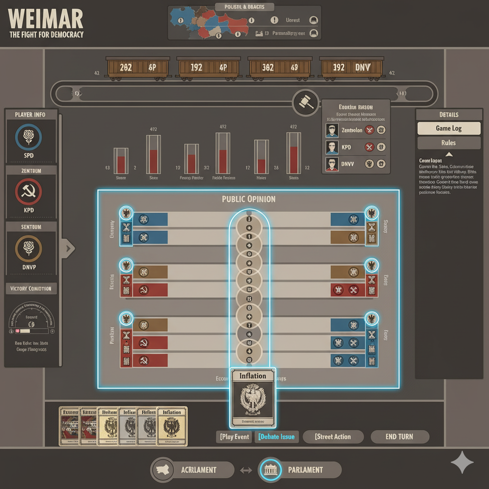

# "바이마르" 디지털 포팅 UI/UX 설계도 (와이어프레임)

**핵심 전제:** '거리 구획(Map View)'과 '의회 구획(Parliament View)'의 두 가지 메인 화면을 스위치를 통해 전환.

---

## **1. 메인 화면 전환 스위치 (Global UI Element)**

* **위치:** 화면 하단 중앙 (어떤 화면에 있든 항상 고정)
* **구성:**
  * `[지도 아이콘]` **거리** (현재 활성화된 화면은 강조 표시)
  * `[↔ 전환 아이콘]` (클릭 시 전환)
  * `[의사당 아이콘]` **의회** (현재 활성화된 화면은 강조 표시)
* **UX:** 부드러운 전환 애니메이션 (예: 좌우 슬라이드)과 함께 화면이 전환됩니다.

---

## **2. 거리 구획 (Map View) 설계도**

**목적:** 독일 전역의 영향력, 준군사조직 배치, 도시 안정도 등 '거리'에서의 물리적 상황을 파악하고 행동하는 화면.

---

### **상세 구성 요소:**

* **상단: 미니 의회 바 (Mini Parliament Bar)**
  * **위치:** 상단 중앙
  * **구성:**
    * `[진영별 의석 수 요약]` (작은 막대 그래프 또는 숫자)
    * `[핵심 여론 쟁점 아이콘]` (예: 경제, 외교) 및 현재 우세 진영 표시
  * **UX:** 플레이어가 지도를 보면서도 의회 상황의 큰 변화를 놓치지 않도록 가장 중요한 정보를 압축하여 제공합니다.

* **중앙: 독일 지도 (Interactive Map)**
  * **구성:**
    * **도시:** 클릭 가능한 상호작용 지점. 각 도시 위에 현재 `영향력 토큰 수`와 `지배 정당 아이콘`, `불안/위협 마커`가 표시됩니다.
    * **경계선:** 지역 구분이 명확해야 합니다.
    * **트랙:** 위협 수준(Threat Level) 등 지도에 직접적으로 관련된 트랙은 지도 위나 근처에 시각화하여 배치합니다.
  * **UX:**
    * **마우스 오버/탭:** 도시 위에 커서를 올리거나 탭하면 툴팁으로 도시 이름, 안정도, 주둔 병력 등 요약 정보가 나타납니다.
    * **클릭:** 도시를 클릭하면 우측 `상세 정보 창`에 해당 도시의 모든 정보(유닛 목록, 이벤트 효과 등)가 표시됩니다.
    * **액션 유도:** 카드를 선택하고 '거리 활동'을 누르면, 카드 배치/이동 가능한 도시들이 빛나는 하이라이트 효과로 표시됩니다.

* **좌측: 플레이어 정보 패널 (Player Info Panel)**
  * **구성:** `내 정당` + `상대 3개 정당` 정보 리스트. 각 정당별 `아이콘`, `현재 VP`, `자원(준군사조직 토큰)`, `승리 조건 게이지/아이콘` 요약.
  * **UX:**
    * **내 정보:** 내 정당 정보는 가장 위에 배치하고, 더욱 상세하게 표시합니다.
    * **확장/축소:** 각 플레이어 패널을 클릭하면 해당 플레이어의 공개된 상세 정보(공개된 카드 수, 영향력 높은 도시 등)를 확장하여 볼 수 있습니다. 패널 자체도 좌측으로 접어 지도를 넓게 볼 수 있습니다.

* **하단: 카드 핸드 및 액션 (Card Hand & Action Bar)**
  * **구성:** `현재 손에 있는 카드들` (썸네일 형식), `턴 종료 버튼`. 선택된 카드는 확대되어 나타나며, 아래에 `[이벤트로 사용]`, `[토론에 사용]`, `[거리 활동]` 버튼이 활성화됩니다.
  * **UX:**
    * **카드 드래그 앤 드롭:** 카드를 끌어 지도 위나 다른 유효한 대상으로 놓는 직관적인 조작을 지원합니다.
    * **버튼 액션:** 카드를 클릭 후 버튼을 눌러 액션을 확정합니다.

* **우측: 게임 로그 및 상세 정보 (Game Log & Details)**
  * **구성:** 탭 형식: `Game Log`, `Details`, `Rules`
    * **Game Log:** 모든 플레이어의 행동과 주요 이벤트 기록 (필터링 기능 제공).
    * **Details:** 지도 상의 특정 요소를 클릭했을 때(도시, 토큰 등) 그에 대한 모든 상세 정보가 표시되는 공간.
    * **Rules:** 게임 규칙 검색 및 참조 기능.
  * **UX:** 필요한 정보를 찾아볼 때만 사용하는 보조적인 패널. 접고 펼치는 기능을 제공하여 지도 시야를 확보할 수 있습니다.

---

## **3. 의회 구획 (Parliament View) 설계도**

**목적:** 의회 의석 분포, 여론 쟁점 토론 상황, 정부 구성 등 '정치' 상황을 파악하고 행동하는 화면.

---

### 상세 구성 요소

* **상단: 미니 지도 바 (Mini Map Bar)**
  * **위치:** 상단 중앙
  * **구성:**
    * `[독일 지도 미니뷰]` (권역별 지배 정당 색상 표시)
    * `[현재 불안한 도시 수]` 아이콘
    * `[진행 중인 쿠데타/봉기]` 아이콘
  * **UX:** 의회 상황을 보면서도 거리 상황의 위급도를 놓치지 않도록 가장 중요한 정보를 압축하여 제공합니다.

* **중앙 상단: 국회 트랙 (Reichstag Track)**
  * **구성:** 각 정당의 `현재 의석 수`가 명확한 숫자와 함께 그래프로 표시됩니다. `총 의석 수` 대비 비율도 시각화될 수 있습니다.
  * **UX:** 의회 구성원들의 세력 균형을 한눈에 파악할 수 있도록 합니다. 정부 구성 시 필요한 과반수 여부를 직관적으로 보여줍니다.

* **중앙 중단: 여론 쟁점 트랙 (Public Opinion Track)**
  * **구성:**
    * 각 `여론 쟁점(이슈)` 별로 `긍정/부정(좌/우)`으로 나뉜 트랙.
    * 각 정당의 `영향력 마커`가 트랙 위에서 움직입니다.
    * 각 쟁점의 `점수/효과`가 명확히 표시됩니다.
  * **UX:**
    * **마우스 오버/탭:** 쟁점 위에 커서를 올리거나 탭하면 툴팁으로 쟁점의 상세 효과, 관련 규칙이 표시됩니다.
    * **액션 유도:** 카드를 선택하고 '토론'을 누르면, 카드 플레이로 영향을 줄 수 있는 쟁점 트랙들이 밝게 하이라이트 됩니다.
    * **드래그 앤 드롭:** 카드를 직접 쟁점 트랙으로 끌어다 놓아 토론에 참여하는 직관적인 조작을 지원합니다.

* **중앙 하단: 정부 구성 패널 (Government Formation Panel)**
  * **구성:** (정부 구성 페이즈에만 활성화) `현재 정부`, `연정 가능성`, `총리 후보` 등 정부 구성 관련 정보 및 버튼.
  * **UX:** 정부를 구성해야 할 때만 나타나며, 시뮬레이션 기능을 제공하여 어떤 연정이 가능한지 미리 볼 수 있도록 합니다.

* **좌측: 플레이어 정보 패널 (Player Info Panel)**
  * **구성:** 거리 구획과 동일하게 `내 정당` + `상대 3개 정당` 정보 리스트. 의회 구획에서는 특히 `정부 참여 여부`나 `각료 지위` 등 정치적 상태를 더 강조하여 표시합니다.
  * **UX:** 거리 구획과 동일하게 확장/축소 기능 제공.

* **하단: 카드 핸드 및 액션 (Card Hand & Action Bar)**
  * **구성:** 거리 구획과 동일.
  * **UX:** 거리 구획과 동일. 단, 이곳에서 '거리 활동' 버튼은 비활성화되거나 경고 메시지가 표시될 수 있습니다.

* **우측: 게임 로그 및 상세 정보 (Game Log & Details)**
  * **구성:** 거리 구획과 동일한 탭 형식.
    * **Details:** 의회 구획에서는 여론 쟁점, 정부 구성 관련 규칙, 특정 정당의 정치적 능력에 대한 상세 정보가 표시됩니다.
  * **UX:** 거리 구획과 동일한 기능 제공.

---

## **UX 흐름: 지능적인 자동 화면 전환 예시**

1. **시작:** 플레이어는 **거리 구획**에 있습니다.
2. **카드 선택:** 하단 `카드 핸드`에서 `[민주주의 수호]` 카드를 클릭합니다.
3. **액션 선택:** 카드 아래에 활성화된 `[이벤트로 사용]`, **`[토론에 사용]`**, `[거리 활동]` 버튼 중 **`[토론에 사용]`**을 클릭합니다.
4. **자동 전환:** 게임이 부드러운 애니메이션과 함께 자동으로 **의회 구획**으로 전환됩니다.
5. **액션 유도:** 전환된 의회 구획에서 `여론 쟁점 트랙` 중 `[민주주의 수호]` 카드를 사용할 수 있는 쟁점들(예: 경제 안정, 외교 관계)이 밝게 하이라이트 됩니다.
6. **토론 완료:** 플레이어가 원하는 쟁점을 선택하여 카드 효과를 적용합니다.
7. **선택적 복귀:** 토론 액션 완료 후, 플레이어는 하단 `메인 화면 전환 스위치`를 눌러 다시 **거리 구획**으로 돌아가거나, 계속 의회 구획에 머무르며 정치적 상황을 살필 수 있습니다.
